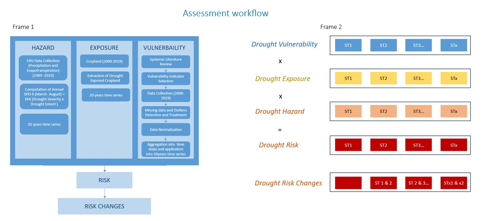
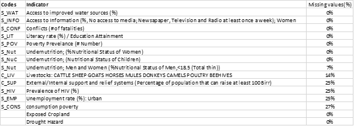
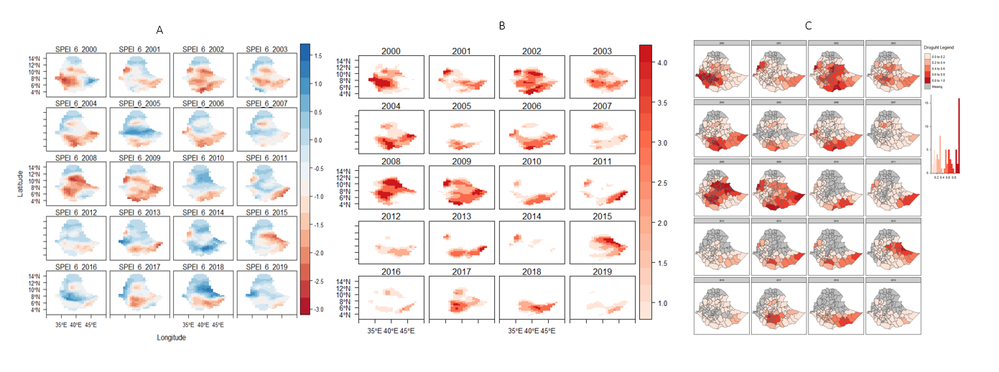
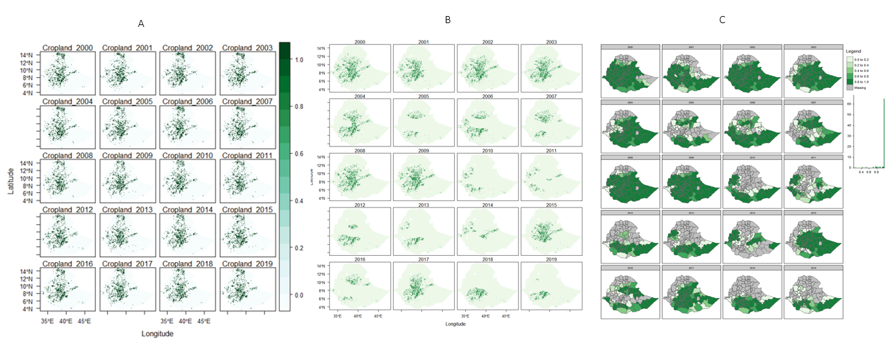
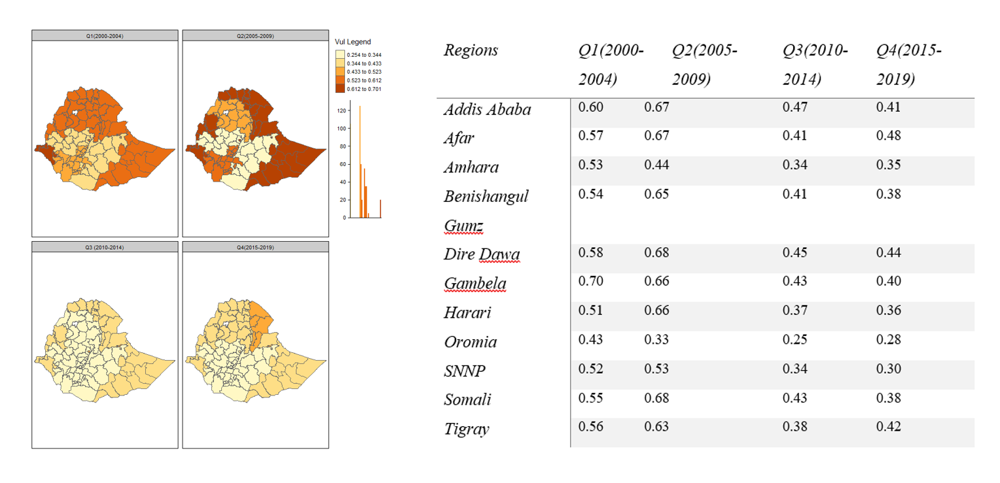
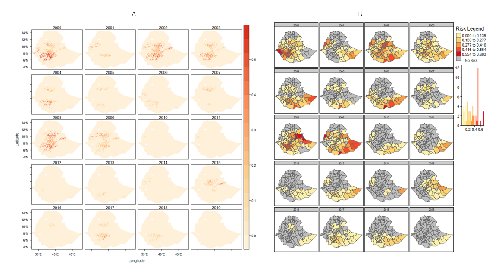

```{=html}
<style>
.bold-hr {
    border: none;
    border-top: 3px solid black;
    color: black;
    text-align: center;
    font-weight: bold;
}
.normal-hr {
    border: none;
    border-top: 1px solid black;
    color: black;
    text-align: center;
}
</style>
```
<!-- <hr class="bold-hr"> -->

<hr class="normal-hr">


## 1.0 Background and Abstracts

This is a mini report from my Msc Thesis where I show the workflow and method applied in assessment of Spatiotemporal Risk and Risk Changes for Rain-fed Agriculture in Ethiopia. 

**DISCLIAMER***: The result of this assessment is not intended for operational purpose of any form, this is mainly for informative and showcasing building index models for risk assessment. More so a different is recommended for operational purposes.

* The outline will include: 
  - An abstract 
  - The Methodology 
  - Results and script

Drought in Ethiopia impacts agriculture severely. Previous drought assessments neglected the temporal dimension, hindering proper monitoring. This assessment used composite indicators to analyze drought risk between 2000 and 2019 and the findings reveal that the first half of the last two decades had more risk due to severe droughts and highly exposed croplands. The years 2000, 2002, and 2008 experienced major droughts. 

Data and Sources (Check Annex)

## 2.0 Methodology and Workflow

<hr>

### Assesemnt framework and workflow
<br>
 **Frame 1** = The Workflow <br> **Frame 2** = The Methodology

Drought risk and risk changes workflow

1. Selection of each risk dimensions result; Hazard, Exposure and Vulnerability
2. Using equation, **Risk = Hazard x Exposure x Vulnerability)** normalized risk values was used to calculate the each year’s risk. 
3. To calculate the risk changes, the preceding years was used as base years and the later years was subtracted from the preceding years.

<hr>

### Drought Hazard Assessment

The primary variables(Data and Sources Table) used to characterize droughts was based on the concept of drought severity (DS), which is a crucial parameter for assessing the intensity and strength of drought in a given area (Zhang et al., 2015). DS is closely related to the water deficit and is calculated by summing or averaging the absolute differences between drought values and threshold values used for drought identification (Vogt & Naumann, 2018; Wang et al., 2018). The assessment of drought severity was conducted at multiple spatial scales, including pixel and zonallevels, over the period of 2000 to 2019.

In this analysis, drought severity was defined as values less than or equal to -0.5, based on the work of Gustavo Naumann et al. (2019), and areas with wet conditions were excluded from the study's scope. The severity of drought was determined by the magnitude of negative values of Standardized Precipitation Evapotranspiration Index (SPEI), with more negative values indicating more severe drought conditions. Drought was identified when SPEI values dropped below -0.5, indicating a deficit in rainfall compared to atmospheric demand (Gebremeskel Haile et al., 2020).

Once the drought threshold was established, regions experiencing extreme drought were used to calculate the drought hazard index. The first step involved calculating the yearly drought index at the pixel level, which was then aggregated to the zonal level for further analysis. This approach allowed for a comprehensive assessment of drought severity and hazard across different spatial scales and over an extended time period.

### Exposure Assessemnt

The dataset used for the assessing rainfeed exposure ((Data and Sources Table) is the annual land cover (LC) maps by the European Space Agency Climate Change Initiative (ESA-CCI), which provides consistent 300m resolution LC maps on an annual basis from 1992 to 2019 (Version 2.0.7cds) and 2016 to 2019 (Version 2.1.1) (Bontemps et al., 2013; Liu et al., 2018).

The rainfed cropland in Ethiopia is the specific element under consideration in this research, and the annual cropland areas were extracted from the global dataset using R software (R version 4.0.2). The areas of rainfed cropland were then calculated in relation to the drought coverage areas. The outcome was an annual Hazard/Exposure calculated on a regional basis for each of the regions, and the percentage area of exposed areas was calculated using ArcGIS 10.3.1. This allows for an assessment of the extent of exposure of rainfed cropland in Ethiopia to drought events. Overall, this methodology utilizes state-of-the-art remote sensing data and advanced statistical tools to assess the hazard and exposure of drought events on rainfed cropland in Ethiopia.

### Vulnerability Assessesment

In order to assess the vulnerability domain, A total of 100 papers were retrieved from the search, out of which 52 were selected for use in this research. In addition, non-systemic literature reviews were conducted through snowball sampling, resulting in the inclusion of 13 additional papers, making a total of 62 papers that were reviewed to identify indicators for drought vulnerability (refer to Annex Table 7 for the list of indicators). The selected papers were analyzed using MAXQDA (VERBI SOFTWARE 2020), and each indicator was identified using a code. The indicators were then grouped into categories such as social susceptibility, lack of coping capacity, environmental susceptibilities, lack of adaptive capacities, agriculture, economic, governance, health, land use, infrastructure, and social.

Data availability for the period of 2000-2019 was checked for the identified indicators. The statistical datasets were retrieved from open sources such as grey literature, country databases, statistical reports, and scientific papers to ensure that the results can be validated and reproduced (Frischen et al., 2020; Naumann et al., 2014). This rigorous approach ensures that the research findings are based on reliable and verified data sources, enhancing the robustness of the study.

The following checks were carried done on the dataset:

-   Indicators and Data Cleaning
-   Missing values detection
-   Outliers Detection and Treatment
-   Multicollinearity Analysis
-   Data Normalization

Here is was the final list of the **vulnerability indicator** considered and the missing values(%) 

## 3.0 Results and script that generated the vizuals

<hr>

### Drought Hazards


Scripts for this visuals here (Links)

```
The results show that the first decade of the analysis experienced more severe drought events than the last decade. The years 2000, 2002, 2008, and 2009 were the most drought-affected years, while 2007, 2011, 2012, 2016, and 2019 were the least affected years. The central and southern parts of Ethiopia were more affected by drought, while the northern part was less affected.

The regions that were most affected by drought, in order of severity, were Dire Dawa, Harari, and SNNP, while Tigray, Afar, and Amhara were the least affected. The top five zones with the most severe drought events were Gedeo, Kembata Tibaro, Harari, Halaba, and Sidama, while Central Gondar, Southern Tigray, Wag Hamra, and Fanti were the least affected.

It should be noted that the results are based on average normalized values, and therefore, careful interpretation is required. The findings are consistent with previous studies on drought in Ethiopia, which have highlighted severe drought events in the years 2004, 2005, 2008, 2010, and 2012. Additionally, the eastern part of Ethiopia received less rainfall compared to the western part.
```

### Exposed Croplands



```
The analysis shows that croplands were more exposed to drought severity in the first half of the decade than the second half, similar to the trend observed in drought severity. However, there were variations in the years of exposure. While 2008 experienced the most severe drought, the year 2000 had the highest exposure of cropland to drought. This was followed by 2008, 2009, and 2001. In the second half of the decade, years 2017 and 2018 experienced the most exposure.

On average, the regions with the most exposed croplands were Dire Dawa (0.94), Harari (0.93), Addis Ababa (0.91), and SNNP (0.82). Tigray was the only region with no exposure of croplands to drought. When analyzing yearly exposure trends, SNNP had the highest exposure in 2000 and 2002, with about 99% of crops being exposed to severe drought.

On the zonal level, more than three-quarters of the zones with croplands had an exposure index greater than 0.54. The most exposed zones on average were Baseko, Mao Komo, and Dire Dawa, with 99% of crop areas being exposed
```

### Vulnerability

```
The vulnerability of different regions can be measured by indicators such as their coping capacity and social susceptibility. Based on these indicators, some regions are more vulnerable than others. For example, the regions of Amhara, Oromia, SNNP, and Afar are the most socially susceptible, while Gambela, Harari, and Benishangul Gumz are the least susceptible. Similarly, regions like Gambela, Addis Ababa, and Dire Dawa are found to be more lacking in coping capacities compared to regions like Oromia, Amhara, and SNNP which are the least lacking. By examining these vulnerability indicators, we can understand the reasons behind why some regions are more vulnerable than others.

Gambela, on average, is the most vulnerable region. However, its vulnerability is mainly driven by its lack of coping capacity, which scored the highest at 0.79 in the region. In contrast, its social susceptibility score is low at 0.30.
```

### Spatial and temporal risk



```
The risk of drought in the country has decreased over the time periods studied. The years 2000, 2002, and 2008 had the highest risk index values, while 2012, 2019, and 2016 had the lowest. This finding is consistent with the hazard analysis conducted on a yearly basis, which showed that hazard values were highest in 2000, 2002, and 2008.

However, the drivers of risk varied over time. For instance, in 2008, the year with the highest drought risk, the main driver of risk was the exposed cropland. This was the highest ranking dimension of risk for all the time periods studied.
```
## ANNEX

### Data and Sources

| ID | Components | Category | Sub-category | Indicator | Direction | Source |
| --- | --- | --- | --- | --- | --- | --- |
| 1 | Vulnerability | Coping Capacity | Economic | External/Internal support and relief systems (< 100 Birr) | - | Poverty and Economic Growth in Ethiopia pdf |
| 2 | Vulnerability | Coping Capacity | Agriculture | Livestock (# of cattle herds) | - | Ethiopia Open Data |
| 3 | Vulnerability | Social Susceptibility | Health | Access to improved water sources (%) | - | DHS |
| 4 | Vulnerability | Social Susceptibility | Social | Literacy rate (%) / Education Attainment | - | DHS |
| 5 | Vulnerability | Social Susceptibility | Infrastructure | Access to information (%) | - | DHS |
| 6 | Vulnerability | Social Susceptibility | Economic | Poverty Prevalence (%) | + | Poverty and Economic Growth in Ethiopia pdf |
| 7 | Vulnerability | Social Susceptibility | Economic | Unemployment rate (%) | + | https://www.statsethiopia.gov.et/our-survey-reports/ |
| 8 | Vulnerability | Social Susceptibility | Health | Prevalence of HIV (%) | + | DHS |
| 9 | Vulnerability | Social Susceptibility | Health | Undernutrition; (Men and Women) | + | DHS |
| 10 | Vulnerability | Social Susceptibility | Health | Undernutrition; (Nutritional Status of Children) | + | DHS |
| 11 | Vulnerability | Social Susceptibility/Coping | Social | Prevalence of conflict and insecurity (# of events between 2001-2018) | + | ACLED |
| 12 | Vulnerability | Social Susceptibility | Economic | Consumption Poverty | + | Poverty and Economic Growth in Ethiopia pdf |
| 13 | Hazard | Drought | Precipitation, Temprature and evapotranspiration |  | Climatic Research Unit (CRU) Time-Series (TS) version 4.04 |  |
| 14 | Exposure | Cropland | Rainfed cropland |  | European Space Agency Climate Change Initiative (ESA-CCI) |  |
|  |  |  |  |  |  |  |

<span style="font-size: 8pt; font-style: italic;">*Demographic and health survey (DHS).</span>

<span style="font-size: 8pt; font-style: italic;">*Armed Conflict Location & Event Data Project (ACLED).</span>

