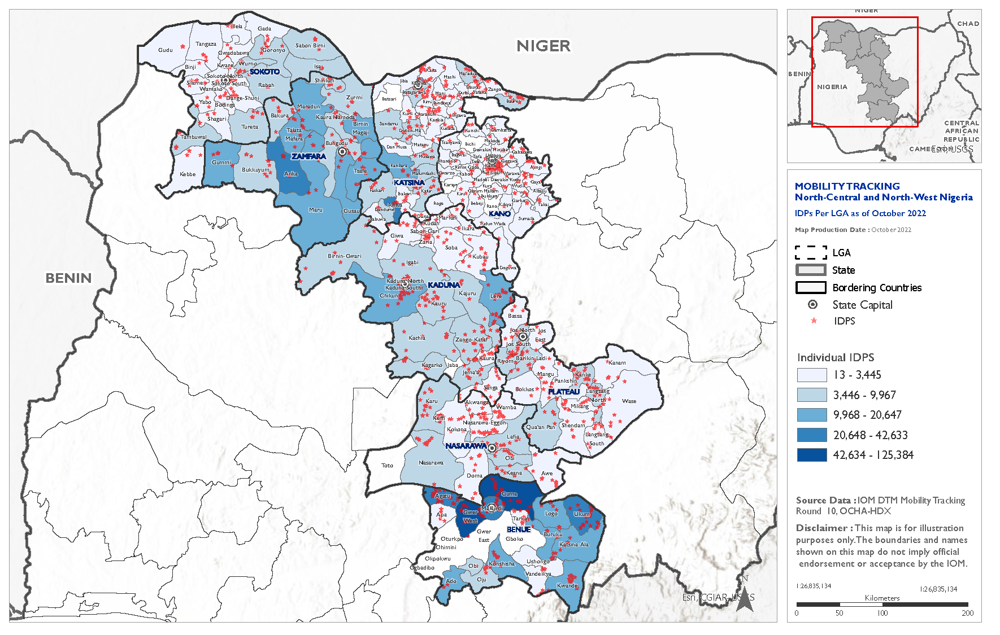

<hr>
```{r setup, include=FALSE}
knitr::opts_chunk$set(echo = FALSE)
library(gridExtra)
library(knitr)
```

## ArGIS Online
<iframe src="https://www.arcgis.com/apps/mapviewer/index.html?webmap=f2c20e15bd7a430a9bd24b8413291b97" width="100%" height="500"></iframe>

<hr>
<hr>

## Static Maps 
### Arctic Sea Ice decline made from a turoral

<hr>

### Displacement Map

<hr>
### DTM Map

<hr>


<hr>

### Map of Papua New  Guinea

<hr>

### Map of Vanuatu
