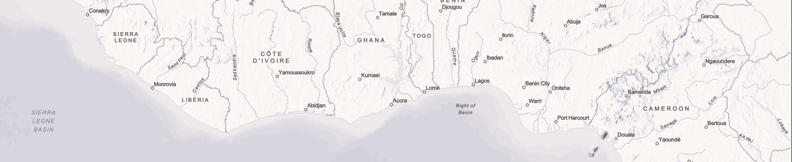

<!-- <hr> -->
<!-- # ```{r setup, include=FALSE} -->
<!-- # knitr::opts_chunk$set(echo = FALSE) -->
<!-- # library(gridExtra) -->
<!-- # library(knitr) -->
<!-- # ``` -->


<hr>
{ width=200% height=50% }
<hr>
## **1.0 STATIC MAPS** 

### Arctic Sea Ice decline

<hr>

### Report Maps

[Link to Report publication](https://dtm.iom.int/reports/nigeria-north-central-and-north-west-mobility-tracking-round-10-idp-atlas-october-2022)
<hr>
### Papau New Guinea


<hr>

### South Sudan

<hr>

<!-- ### Map of Vanuatu -->
<!--  -->

<hr>

**## 2.0 INTERACTIVE MAPS** 
<hr>

### ArGIS Online

A Bangladesh map showing Spatial flood risk assessment 
in the Ganges-Brahmaputra-Meghna delta in Bangladesh 

[Flood Risk App](https://www.arcgis.com/apps/instant/basic/index.html?appid=6310e845625645aebd5161856ea5c3c5&locale=en-gb)

This map shows Spatial flood risk assessment in the Ganges-Brahmaputra-Meghna delta in Bangladesh. This assessment calculated flood risk using the equation; **FLOOD RISK = FLOOD HAZARD x FLOOD EXPOSURE x VULNERABILITIES.(*Tutorial Purpose*)**


<iframe src="https://www.arcgis.com/apps/instant/basic/index.html?appid=6310e845625645aebd5161856ea5c3c5&locale=en-gb" width="800" height="600" frameborder="0" style="border:0" allowfullscreen></iframe>
*The index score used ranges from 0-1. with 0 being least at risk and 1 being most at risk of floods*

<hr>

[Somalia River Basin](https://africageoportal.maps.arcgis.com/apps/instant/interactivelegend/index.html?appid=2757cff308dd4e1f9bbf36e8052ee1f0)
The River Basins in Somalia

<iframe src="https://africageoportal.maps.arcgis.com/apps/instant/interactivelegend/index.html?appid=2757cff308dd4e1f9bbf36e8052ee1f0" width="800" height="600" frameborder="0" style="border:0" allowfullscreen>iFrames are not supported on this page.</iframe>


### West African cities (in Progress)

A Leaflet map to show the location of cities and their nearest cities, boarders and populations

```r
# Load the necessary packages
library(leaflet)
```

```
## Warning: package 'leaflet' was built under R version 4.2.3
```

```r
library(dplyr)
```

```
## 
## Attaching package: 'dplyr'
```

```
## The following objects are masked from 'package:stats':
## 
##     filter, lag
```

```
## The following objects are masked from 'package:base':
## 
##     intersect, setdiff, setequal, union
```

```r
# Create a data frame with the capital cities and their coordinates
west_africa <- data.frame(
  country = c("Nigeria", "Ghana", "Sierra Leone", "Liberia", "Cote d'Ivoire", "Burkina Faso", "Mali", "Senegal", "Guinea-Bissau", "Guinea", "Gambia", "Togo", "Benin"),
  capital_city = c("Abuja", "Accra", "Freetown", "Monrovia", "Yamoussoukro", "Ouagadougou", "Bamako", "Dakar", "Bissau", "Conakry", "Banjul", "Lome", "Porto-Novo"),
  latitude = c(9.0765, 5.6037, 8.4840, 6.3106, 6.8206, 12.3714, 12.6392, 14.7167, 11.8630, 9.5357, 13.4531, 6.1319, 6.4968),
  longitude = c(7.3986, -0.1870, -13.2299, -10.8047, -5.2764, -1.5330, -8.0029, -17.4677, -15.5976, -13.6788, -16.5790, 1.2221, 2.6059)
)

# Create the map using Leaflet
leaflet(west_africa, options = leafletOptions(width = "800px")) %>%
  addTiles() %>%
  addMarkers(
    ~longitude,
    ~latitude,
    popup = ~paste(country, "<br>", capital_city, sep = "")
  )
```

```{=html}
<div class="leaflet html-widget html-fill-item-overflow-hidden html-fill-item" id="htmlwidget-74a6fc95ce7568a9ec9c" style="width:672px;height:480px;"></div>
<script type="application/json" data-for="htmlwidget-74a6fc95ce7568a9ec9c">{"x":{"options":{"crs":{"crsClass":"L.CRS.EPSG3857","code":null,"proj4def":null,"projectedBounds":null,"options":{}},"width":"800px"},"calls":[{"method":"addTiles","args":["https://{s}.tile.openstreetmap.org/{z}/{x}/{y}.png",null,null,{"minZoom":0,"maxZoom":18,"tileSize":256,"subdomains":"abc","errorTileUrl":"","tms":false,"noWrap":false,"zoomOffset":0,"zoomReverse":false,"opacity":1,"zIndex":1,"detectRetina":false,"attribution":"&copy; <a href=\"https://openstreetmap.org\">OpenStreetMap<\/a> contributors, <a href=\"https://creativecommons.org/licenses/by-sa/2.0/\">CC-BY-SA<\/a>"}]},{"method":"addMarkers","args":[[9.0765,5.6037,8.484,6.3106,6.8206,12.3714,12.6392,14.7167,11.863,9.5357,13.4531,6.1319,6.4968],[7.3986,-0.187,-13.2299,-10.8047,-5.2764,-1.533,-8.0029,-17.4677,-15.5976,-13.6788,-16.579,1.2221,2.6059],null,null,null,{"interactive":true,"draggable":false,"keyboard":true,"title":"","alt":"","zIndexOffset":0,"opacity":1,"riseOnHover":false,"riseOffset":250},["Nigeria<br>Abuja","Ghana<br>Accra","Sierra Leone<br>Freetown","Liberia<br>Monrovia","Cote d'Ivoire<br>Yamoussoukro","Burkina Faso<br>Ouagadougou","Mali<br>Bamako","Senegal<br>Dakar","Guinea-Bissau<br>Bissau","Guinea<br>Conakry","Gambia<br>Banjul","Togo<br>Lome","Benin<br>Porto-Novo"],null,null,null,null,{"interactive":false,"permanent":false,"direction":"auto","opacity":1,"offset":[0,0],"textsize":"10px","textOnly":false,"className":"","sticky":true},null]}],"limits":{"lat":[5.6037,14.7167],"lng":[-17.4677,7.3986]}},"evals":[],"jsHooks":[]}</script>
```


